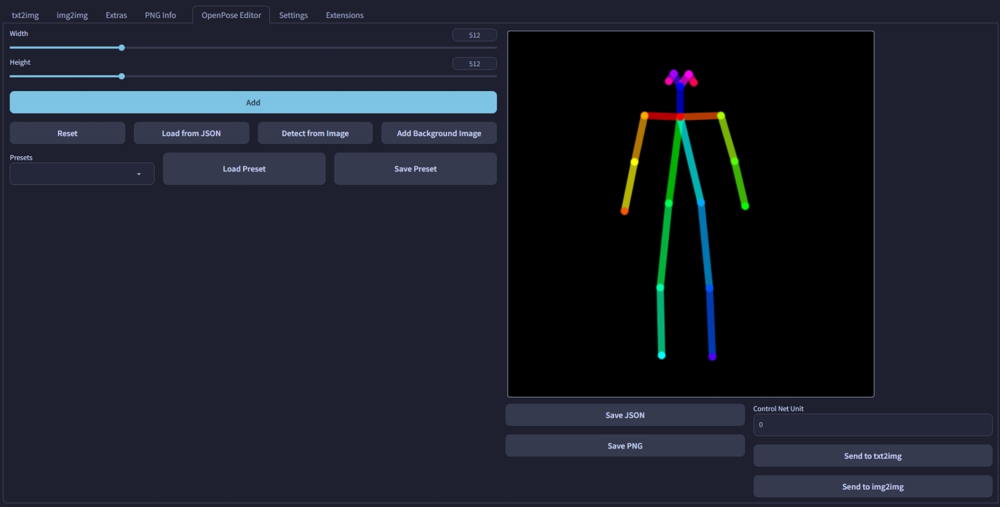

# SD Webui Openpose Editor

Openpose Editor for [Automatic1111 Webui](https://github.com/AUTOMATIC1111/stable-diffusion-webui)

> Now supports `Send to ControlNet` buttons with [Tabs Extension](https://github.com/Haoming02/sd-webui-tabs-extension)

## Features

-  Add multiple avatars
-  Detect poses from image
-  Set background
-  Save as PNG/JSON
-  Send to ControlNet

## Note

Set `Preprocessor` to **None** in ControlNet
